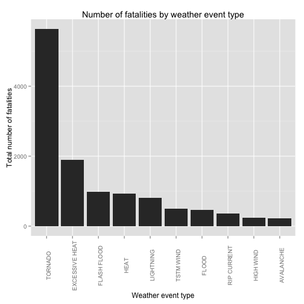
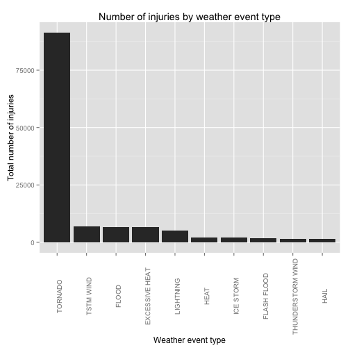
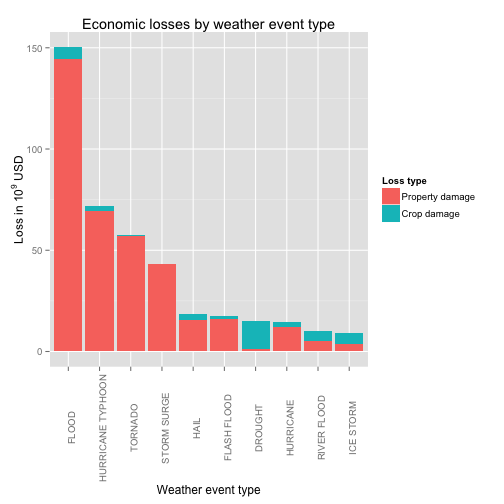

# Analysis of NOAA Storm Database.

## Synopsis
The goal of the analysis is to detect types of weather events that causes most damages
with respect to population health and with respect to economic consequences. The
analysis is based on data from U.S. National Oceanic and Atmospheric 
Administration's (NOAA) storm database. The used copy of the database is located
[here](https://d396qusza40orc.cloudfront.net/repdata%2Fdata%2FStormData.csv.bz2)
and contains data about severe weather events from 1950 to November 2011.

We found that tornados have by far the most influence on population health. 

Floods are the worst weather events when comparing the effects on economic losses.

## Data processing
At first we load R libraries used in analysis:

```r
library(dplyr)
library(ggplot2)
library(knitr)
library(reshape2)
```

Then we dowload and load the data:

```r
## there's no need to download multiple times
if (!file.exists("repdata-data-StormData.csv.bz2")){ 
    download.file("https://d396qusza40orc.cloudfront.net/repdata%2Fdata%2FStormData.csv.bz2", destfile = "repdata-data-StormData.csv.bz2", method = "libcurl", mode = "w")
} 

storm_data <- tbl_df(read.csv("repdata-data-StormData.csv.bz2"))
```

The data in the column `EVTYPE` containing information about type of weather event
contains obvious duplicates (written with uppercase letters vs. mixed upper- and
lowercase; leading and trailing spaces; multiple spaces between words, various word
separating characters; etc.).

We union the aforementioned cases. This result into 837 different event types out of
original 985 ones.

[We can do a lot more either by hand or programatically, for example:
* correct typos ("THUNDERSTORM WINS" is one of the favourites)
* remove some observations corresponding to `EVTYPE` "Summary ..."
* join some observations (e.g. winds with specified velocity)
* maybe join different types of wind into one event type, etc.

As almost all these event types are rare in the dataset, for this rough study we decided
not to union event types more precisely.]


```r
storm_data_c <- storm_data %>%  mutate(EVTYPE_CLEANED = toupper(EVTYPE)) %>%
    mutate(EVTYPE_CLEANED = gsub("[^a-zA-Z0-9]", " ", EVTYPE_CLEANED)) %>%
    mutate(EVTYPE_CLEANED = gsub("( )+", " ", EVTYPE_CLEANED)) %>% 
    mutate(EVTYPE_CLEANED = gsub("^( )+|( )+$", "", EVTYPE_CLEANED))
```

From the processed dataset we compute total injuries, fatalities and economic losses.
Economic losses are stored in column `PROPDMG` with exponent in column `PROPDMGEXP`
and column `CROPDMG` with exponent in `CROPDMGEXP` respectively.

We explore columns with exponents and extract all unique values.


```r
print(unique(c(levels(storm_data_c$PROPDMGEXP), levels(storm_data_c$CROPDMGEXP))))
```

```
##  [1] ""  "-" "?" "+" "0" "1" "2" "3" "4" "5" "6" "7" "8" "B" "h" "H" "K"
## [18] "m" "M" "k"
```
Letters correspond to powers of ten ("h"/"H" -> hundreds, "k"/"K" -> thousands, etc.).

We construct a little function that translate each letter into corresponding
power:


```r
letter_to_power <- function(x){
    return(switch(as.character(x), "h" = , "H" = 100, "k" = , "K" = 1000, 
                  "m" = , "M" = 10 ** 6, "b" = , "B" = 10 ** 9, 1))
}
```

Now we extract all the data for final analysis:


```r
damages <- group_by(storm_data_c, EVTYPE_CLEANED) %>%
    summarise(injuries = sum(INJURIES), fatalities = sum(FATALITIES),
              prop_dmg_sum = sum(PROPDMG * sapply(PROPDMGEXP, letter_to_power)),
              crop_dmg_sum = sum(CROPDMG * sapply(CROPDMGEXP, letter_to_power))) %>% 
    mutate(dmg_sum = prop_dmg_sum + crop_dmg_sum)
```

## Results
### Effects on population health
At first we present the ten weather event types causing most fatalities:

```r
fatalities_plot_data <- 
    arrange(damages, desc(fatalities))[1:10, c("EVTYPE_CLEANED", "fatalities")]
kable(fatalities_plot_data, col.names = c("Event type", "Total fatalities"))
```


|Event type     | Total fatalities|
|:--------------|----------------:|
|TORNADO        |             5633|
|EXCESSIVE HEAT |             1903|
|FLASH FLOOD    |              978|
|HEAT           |              937|
|LIGHTNING      |              817|
|TSTM WIND      |              504|
|FLOOD          |              470|
|RIP CURRENT    |              368|
|HIGH WIND      |              248|
|AVALANCHE      |              224|

And the corresponding barplot:

```r
qplot(reorder(EVTYPE_CLEANED, fatalities, function(x)-x),
      fatalities,
      data = fatalities_plot_data, 
      geom = "bar", 
      stat = "identity",
      main = "Number of fatalities by weather event type",
      xlab = "Weather event type",
      ylab = "Total number of fatalities") +
    theme(axis.text.x = element_text(angle = 90))
```

 

Similarly we process injuries:

```r
injuries_plot_data <- 
    arrange(damages, desc(injuries))[1:10, c("EVTYPE_CLEANED", "injuries")]
kable(injuries_plot_data, col.names = c("Event type", "Total injuries"))
```


|Event type        | Total injuries|
|:-----------------|--------------:|
|TORNADO           |          91346|
|TSTM WIND         |           6957|
|FLOOD             |           6789|
|EXCESSIVE HEAT    |           6525|
|LIGHTNING         |           5230|
|HEAT              |           2100|
|ICE STORM         |           1975|
|FLASH FLOOD       |           1777|
|THUNDERSTORM WIND |           1488|
|HAIL              |           1361|

And the corresponding barplot:

```r
qplot(reorder(EVTYPE_CLEANED, injuries, function(x)-x),
      injuries,
      data = injuries_plot_data, 
      geom = "bar", 
      stat = "identity",
      main = "Number of injuries by weather event type",
      xlab = "Weather event type",
      ylab = "Total number of injuries") +
    theme(axis.text.x = element_text(angle = 90))
```

 

### Effects on economics
We extract 10 types of weather events with the biggest economic losses and present
them in table and a figure.

Values in table are in 10<sup>9</sup> USD:

```r
ec_loss_data <- 
    arrange(damages, desc(dmg_sum))[1:10, 
                                    c("EVTYPE_CLEANED", 
                                      "prop_dmg_sum", 
                                      "crop_dmg_sum", 
                                      "dmg_sum")]
ec_loss_data[, 2:4] <- ec_loss_data[, 2:4] / 10**9
kable(ec_loss_data, 
      col.names = c("Event type", 
                    "Property damage", 
                    "Crop damage",
                    "Total damage"),
      digits = 2)
```


|Event type        | Property damage| Crop damage| Total damage|
|:-----------------|---------------:|-----------:|------------:|
|FLOOD             |          144.66|        5.66|       150.32|
|HURRICANE TYPHOON |           69.31|        2.61|        71.91|
|TORNADO           |           56.94|        0.41|        57.35|
|STORM SURGE       |           43.32|        0.00|        43.32|
|HAIL              |           15.73|        3.03|        18.76|
|FLASH FLOOD       |           16.14|        1.42|        17.56|
|DROUGHT           |            1.05|       13.97|        15.02|
|HURRICANE         |           11.87|        2.74|        14.61|
|RIVER FLOOD       |            5.12|        5.03|        10.15|
|ICE STORM         |            3.94|        5.02|         8.97|

At last we present a barplot with these results.

A little data preprocessing has to be done in order to present desired plot.


```r
ec_loss_plot_data <- melt(ec_loss_data, "EVTYPE_CLEANED", 
                          c("prop_dmg_sum", "crop_dmg_sum"),
                          variable.name = "type", value.name = "dmg")
levels(ec_loss_plot_data$type) <-  c("Property damage", "Crop damage")
ggplot(data = ec_loss_plot_data) +
    aes(x = reorder(EVTYPE_CLEANED, dmg, function(x)-sum(x)), y = dmg, fill = type) +
    geom_bar(stat = "identity") +
    ggtitle("Economic losses by weather event type") +
    labs(x = "Weather event type",
      y = expression(paste("Loss in ", 10^{9}, " USD")),
      fill = "Loss type") +
    theme(axis.text.x = element_text(angle = 90))   
```

 


##Summary
We can conlude that among different severe weather events, the worst impact on
population health have tornados. When we compare the events by their effect expressed
by the means of economic losses, the highest impact have floods.
